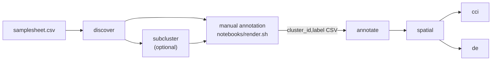

# CosMx-Nf

A Nextflow (DSL2) pipeline for single-cell spatial transcriptomics from the Bruker (NanoString)
CosMx Spatial Molecular Imager. It takes each slide's flat-file export through QC, integration,
clustering and reference-based cell typing. A human-in-the-loop annotation step follows, then
spatial statistics, cell-cell communication and neighbourhood-aware differential expression.
Every step is an R script in `bin/` built on [Giotto](https://giottosuite.com).

It was written for multi-sample FFPE kidney biopsy studies on the CosMx 6K Discovery panel. The
marker panel (`assets/canonical_markers.csv`) and the default reference profiles are
kidney-specific; the rest of the pipeline is tissue-agnostic.

## How a run proceeds

The pipeline runs in stages. Each stage is its own launch (`--stage`) and picks up the Giotto
object the previous stage published, so the manual annotation step can sit between them.



| Stage | Processes | Methods |
|---|---|---|
| `discover` (default) | LOAD, QC, MERGE, INTEGRATE, CLUSTER, HIERATYPE, INSITUTYPE, SUPERVISED, DIAGNOSTICS | Giotto `importCosMx`, with negative probes as their own feature type. Per-sample QC: the count floor is `min(count_cap, count_quantile)`, so it never removes more than a set share of a sample; plus an area cap, an FOV flag and border-cell flags. Normalisation, then the top HVGs unioned with the marker panel, then PCA, then Harmony over the batch columns that vary. A shared-nearest-neighbour graph is clustered with Leiden over a resolution ladder, with UMAPs for the chosen resolutions. HieraType marker typing. Unsupervised InSituType with cohorts from the immunofluorescence channels and neighbourhood expression. Supervised InSituType against reference profiles. Marker-panel diagnostics per chosen column write a label template with a best guess per cluster. |
| `subcluster` | SUBCLUSTER, DIAGNOSTICS | Re-embeds each cluster of a basis column on its own (own HVGs, PCA, Harmony, graph, Leiden) and adds one `sub_<res>` column. Clusters below `subcluster_min_cells` are left whole. |
| manual annotation | `notebooks/render.sh` | Knits `manual_annotation.Rmd` in the container. It covers resolution overview, marker heatmaps and volcano plots, marker-score-guided draft labels, lineage and immunofluorescence checks, and a validation against the annotate contract. It writes a `cluster_id,label` CSV for you to curate. |
| `annotate` | APPLY_LABELS, COMPOSITION | Joins the curated labels onto the cluster column (`cell_type`, `cell_type_l1`) and draws a marker dot plot. Composition per sample, with the per-subject change against a baseline inside each treatment group. |
| `spatial` | SPATIAL_NET, BANKSY, BCELL | A Delaunay network with a maximum edge length, and cell-type proximity enrichment per sample against a permutation null. BANKSY spatial domains at a cell-typing and a domain-finding lambda. B-lineage subclustering. |
| `cci` | CCI_LIANA, CCI_NICHENET, CCI_MISTY, CCI_SPARKX, CCI_NNSVG, CCI_INSITUCOR | LIANA ligand-receptor consensus weighted by Delaunay contact. NicheNet ligand activity per comparison and receiver type. MISTy intra, juxta and para views per sample. SPARK-X spatially variable genes beyond cell-type composition, refined with nnSVG. InSituCor spatial co-expression modules. |
| `de` | SMIDE, SMIDE_META | smiDE per sample x cell type (a GLMM on niche membership, with neighbour-expression and spatial terms), pooled across samples by fixed-effect meta-analysis. |
| `diagnose` | DIAGNOSTICS | Re-runs the diagnostics on existing columns without recomputing anything upstream. |
| `supervised` | SUPERVISED, DIAGNOSTICS | Re-runs the supervised InSituType passes against the published discover object. |
| `report` | REPORT | Rebuilds `run_report.md` from the published results. |

Every stage ends by rewriting `run_report.md`, a Markdown summary of the run so far. It covers
samples and QC, integration settings, clusters per resolution, reference typing, subclusters,
cell-type composition, spatial statistics, CCI and DE hits, and links to the main figures.

## Requirements

- Nextflow 24.04 or later (the configuration uses `resourceLimits`). Developed on 26.04, where
  `nextflow lint` reports no errors.
- Apptainer. Every task runs inside one image with R 4.5 and Giotto 4.2. The other R packages
  can live in the image or in an R library bound into it (`r_libs` in `conf/site.yaml`):
  data.table, ggplot2, ggrepel, Matrix, matrixStats, irlba, harmony, scran,
  SingleCellExperiment, SpatialExperiment, InSituType, HieraType, Banksy, liana, nichenetr,
  mistyR, future, SPARK, nnSVG, InSituCor, smiDE and jsonlite. Giotto's Leiden goes through
  reticulate to a Python with leidenalg and python-igraph (`Environment/environment.yml`
  lists the Python side).
- Reference profile matrices for the supervised passes (genes x cell types, `<name>.csv` or
  `.rds`) are not shipped. Stage them in `assets/profiles/`, or set `supervised_profiles` to
  `""` to skip the supervised passes.
- NicheNet ligand-target model files, only for the NicheNet step (`nichenet_model_dir`).

## Running

```bash
git clone https://github.com/CharitidisKP/CosMx-Nf.git
cd CosMx-Nf
cp conf/site.example.yaml conf/site.yaml   # image, R libraries, bind mounts, samplesheet
./run.sh my_run -profile server            # discover
```

`run.sh <run_id> [nextflow options]` is the entry point. It keeps each run in one place,
`../Runs/<run_id>/{results,logs}`, with `work/` on local scratch (`$NXF_SCRATCH_ROOT`, default
`/tmp/$USER-nf`). It passes `conf/site.yaml` as `-params-file` and rejects any `--param` no
config declares, because Nextflow otherwise accepts a mistyped parameter silently. Without it:

```bash
nextflow run main.nf -profile server -params-file conf/site.yaml --outdir results --run_id my_run
```

A full pass, then:

```bash
# Optional: split every cluster of a resolution into subclusters
./run.sh my_run -profile server --stage subcluster --subcluster_basis leiden_clus_res0.3

# Draft labels, then edit Runs/my_run/results/tables/06_annotation/labels/cluster_labels.sub_res0.3.csv
./notebooks/render.sh my_run sub_res0.3

LABELS=../Runs/my_run/results/tables/06_annotation/labels/cluster_labels.sub_res0.3.csv
./run.sh my_run -profile server --stage annotate --cluster_basis sub_res0.3 --labels $LABELS
./run.sh my_run -profile server --stage spatial
./run.sh my_run -profile server --stage cci
./run.sh my_run -profile server --stage de --labels $LABELS
```

- **`-resume`** works on any stage. Tasks use `cache = 'lenient'` (path and size, not timestamps), so a
  shared file system with unreliable timestamps does not invalidate the cache.
- **`--solo <id,id|all>`** also takes the named samples through discovery on their own, without
  MERGE or Harmony (`--solo_only` skips the merged run).
- **`--merged_giotto <dir>`** points any stage after `discover` at a different Giotto object
  than the one the previous stage published.
- **`assets/samplesheet.smoke.csv`** loads three FOVs per sample, for a quick end-to-end check
  of `discover`.

### Profiles

| Profile | What it sets |
|---|---|
| `server` | Local executor on one large machine, every task in the Apptainer image, per-task and total CPU/memory caps. |
| `slurm` | The same container settings with the SLURM executor, a time limit per resource label and `--partition`. |

Resources are set per label in `conf/base.config`. A task that dies with a kill or
out-of-memory exit code is retried once with twice the memory.

## Samplesheet

One row per sample; see `assets/samplesheet.csv`. The real sheets, which carry data paths,
belong outside git: point `input` in `conf/site.yaml` at them (`assets/private/` is gitignored).

| Column | Meaning |
|---|---|
| `sample_id` | Unique sample name, used in every output and by `--solo`. |
| `include` | `TRUE`/`FALSE`. `FALSE` drops the sample from every stage without deleting its row. A missing column counts as `TRUE`. |
| `file_prefix` | Prefix of the flat files in `data_dir` (`<prefix>_exprMat_file.csv.gz`, `<prefix>_metadata_file.csv.gz`, ...). |
| `data_dir` | The sample's flat-file export folder: expression matrix, cell metadata, FOV positions and polygons. Absolute, or relative to the launch directory. |
| `patient_id` | Specimen or patient code, stored on every cell. Use a study code, never a hospital or accession number. |
| `treatment` | Study group. Comparisons stay inside each group (`compare_within`). |
| `timepoint` | Compared against `compare_baseline` (`compare_by`). |
| `slide_id`, `batch` | Physical slide and instrument run; with `batch_column` these are the Harmony covariates. |
| `subset_fovs` | Optional. Semicolon-separated FOV ids to load, e.g. when several samples share one slide's export. |
| `subject_id` | Optional. The person; paired changes in `annotate` and NicheNet are computed within a subject (`pair_by`). |

## Configuration

Every parameter is declared, with a comment, in `nextflow.config`, grouped by step. The ones
most runs touch:

| Parameter | Default | |
|---|---|---|
| `input` | `assets/samplesheet.csv` | Samplesheet. |
| `chosen_resolutions` | `0.3,0.5` | Leiden resolutions that get a UMAP and diagnostics; every resolution in `leiden_res_ladder` is still clustered. |
| `markers` | `assets/canonical_markers.csv` | Marker panel (`cell_type,compartment,gene`) behind the diagnostics and HVG union. |
| `supervised_profiles` | `HCA_Kidney,KPMP` | Reference profiles for supervised InSituType, resolved in `profile_dir`. |
| `compare_by`, `compare_baseline`, `compare_within`, `pair_by` | `timepoint`, `T0`, `treatment`, `subject_id` | The study design, read from the samplesheet by composition and NicheNet. |
| `celltype_column` | `cell_type` | Label used by `spatial`, `cci` and `de`; can be any typing column instead. |
| `untyped_celltypes` | `Low_count` | Labels without a cell identity: kept in the object, left out of LIANA, NicheNet and the typed proportions. |

Machine-specific settings (image, R libraries, Python, bind mounts, profile and NicheNet folders,
the real samplesheet) go in `conf/site.yaml`, copied from `conf/site.example.yaml`. It is a
params file rather than a `-c` config because params set in a `-c` file do not reach the
profile settings built from them.

## Outputs

```
Runs/<run_id>/
├── results/
│   ├── run_report.md                  rewritten at the end of every stage
│   ├── figures/<step>/                01_qc ... 09_de
│   ├── tables/<step>/                 CSVs by the same steps; curated labels in 06_annotation/labels/
│   ├── objects/<stage>/giotto         discover, subcluster, annotate, spatial, solo/<id>
│   ├── pipeline_info/                 <stage>_{report.html,trace.txt,timeline.html,params.json}, stage_log.tsv
│   └── local_export/                  Shiny bundle (shiny/export_app_bundle.sh)
├── logs/nextflow.log
└── work -> <scratch>/<run_id>
```

Steps: `01_qc`, `02_integration`, `03_clustering`, `04_reference_typing`, `05_subclustering`,
`06_annotation`, `07_spatial`, `08_cci`, `09_de`. Each launch also records its parameters
(`<stage>_params.json`) and a line in `stage_log.tsv` with the time, the pipeline commit and
the command line.

## Repository layout

```
main.nf            entry workflow: stage checks, one named workflow per --stage, run records
nextflow.config    parameters, profiles, reports, manifest
conf/              base.config (resources), server.config, slurm.config, site.example.yaml
subworkflows/      discovery, solo, annotation (ANNOTATION, SPATIAL, DE), cci; samplesheet helpers
modules/           one process per file (insitutype_supervised.nf holds SUPERVISED and ATTACH_SUPERVISED)
bin/               the R scripts the processes call
assets/            marker panel and example samplesheets
notebooks/         manual_annotation.Rmd and render.sh, the manual annotation step
shiny/             interactive explorer for a run's results (see shiny/README.md)
Environment/       conda environment for interactive work on the same R version
run.sh             launcher: run folder, scratch work dir, log, site file, parameter check
```

## Shiny explorer

`shiny/` is a local app for browsing a run: UMAP and tissue views coloured by any annotation,
gene expression, depth-matched gene co-detection, and the diagnostics and label tables side by
side. `shiny/export_app_bundle.sh <run_id>` writes a light bundle (~24 MB for ~126k cells)
next to the results, so the app never loads Giotto. Without a bundle it falls back to synthetic
data from `make_demo.R`.

## Limitations

- CosMx exports are large and patient-derived, so the repository ships no test data. The
  smoke samplesheet shows the shape of a minimal run.
- There is no automated test suite or CI yet. Changes are checked with `nextflow lint`, with a
  parse check of every `bin/` script, and by running the affected stages.
- The marker panel and default profiles assume kidney tissue.

## Acknowledgements

Built on Giotto, InSituType, HieraType, Harmony, BANKSY, LIANA, NicheNet, MISTy, SPARK-X,
nnSVG, InSituCor and smiDE. Please cite the methods you use.

## License

MIT, see [LICENSE](LICENSE).
